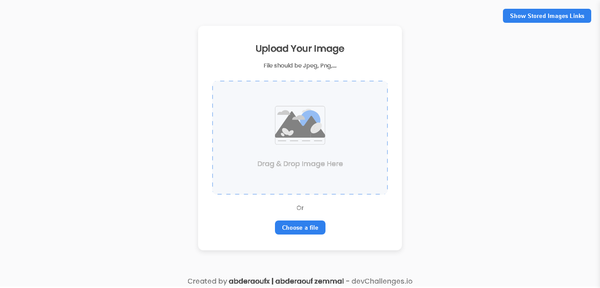
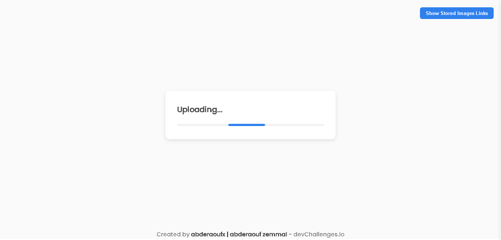
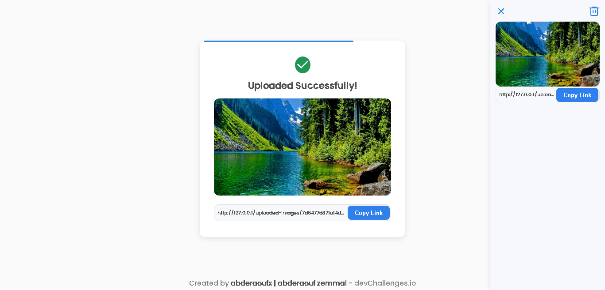

# Image Uploader Project

This project allows users to upload and store images in a centralized location. It provides a simple interface for users to upload images, view uploaded images, Drag & Drop Image to upload, and view previous uploaded images.

<a href="https://img-upl.000webhostapp.com/" target="_blank">See Demo</a>

## Table of Contents

- [Features](#features)
- [Technologies Used](#technologies-used)
- [License](#license)

## Features

- Image uploading with validation.
- Image storage and retrieval.
- View previous photos.
- Multiple Choices To Upload ( click button, drag & drop )

## Technologies Used

- Backend:
  - PHP
- Frontend:

  - HTML, SASS, Typescript

- Remix Icons For Icons

## License

Feel free to modify the template based on your specific project requirements and add more sections or details as needed.
